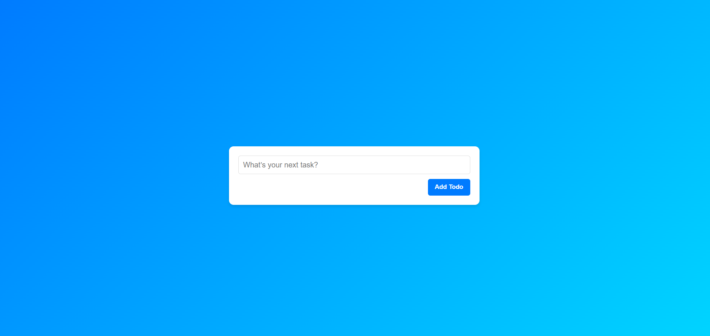
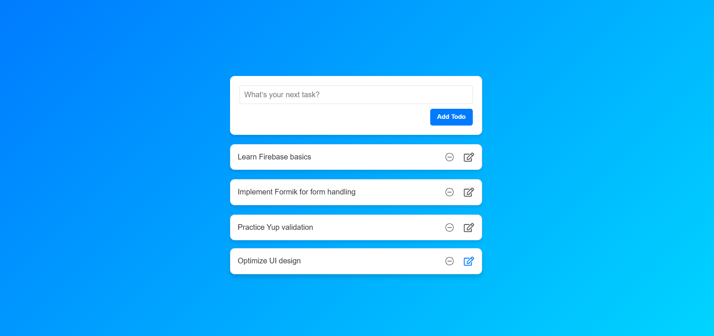

# 📝 React Redux Toolkit + TypeScript To-Do App

A simple yet powerful To-Do application built using **React**, **Redux Toolkit**, and **TypeScript**. Manage your tasks efficiently with state management powered by Redux Toolkit!

---

## 🚀 Features

- 📌 Add, delete, and edit tasks.
- 💾 State management with Redux Toolkit.
- 🔍 Clear and type-safe code with TypeScript.
- 🛠️ Easy to extend and customize.

---

## 📸 Preview

---

## 🛠️ Tech Stack

- **React** ⚛️
- **Redux-Toolkit** 🗂️
- **TypeScript** 💻
- **CSS Modules** 🎨

---
